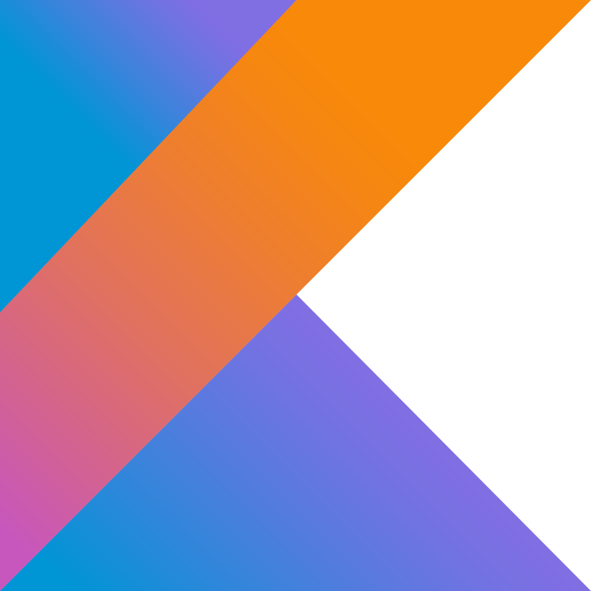
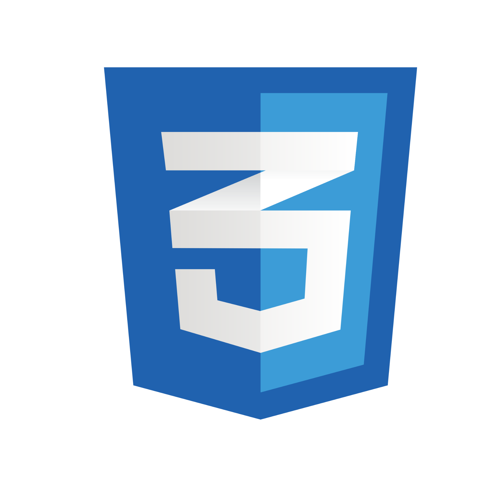

<!---
  All small icons are in 64px^2 
-->

  

 

<table border="0">
  <tbody>
    <tr>
      <td border="0">
        
      </td>
      <td border="0">
        
      </td>
    </tr>
  </tbody>
</table>

 

  Welcome to my GitHub! I'm Jean Carlos, a <b>Junior developer engineer</b> with focus on <i>desktop applications</i> (with Kotlin and Java) and <i>web sites or applications</i> (javascript, html, css) with knowledge of React, Git, GitHub. Self-taught systems engineer with a good level of English. 💻💻

<h3> ⚡ Relevant achievement</h3>

 Study at the Francisco José de Caldas district university at a very low cost.

<h3> 👁 I'm current learning</h3>

<ol>
  <li> Web design</li>
</ol>

<h3> 🧰 My favorite tools</h3>

<ol>
  <li>Desktop apps</li>

  <ul>
    <li>Kotlin (programming language)</li>
    
    <li>Java (programming language)</li>
    
  </ul>
  
  <li>Website/ web application</li>

  <ul>
    <li>HTML5 (markup language)</li>
    
    <li>CSS3 (style sheet language)</li>
    
    <ul>
      <li>Normalize (library)</li>
      
    </ul>
    <li>JavaScript (programming language)</li>
      
    <!--
    <ul>
      <li>React (library)</li>
    </ul>
    <li>PHP (programming language)</li>
    -->
  </ul>
  <!--
  <li>Backend</li>
  
  <ul>
    <li>SQL</li>
  </ul>
  -->
</ol>

<h3> 🧰 Other tools I have used</h3>

<ol>
  <li>Python (programming language)</li>
  
  <li>C++ (programming language)</li>
  
  <li>TeX (document file format)</li>
 </ol>
